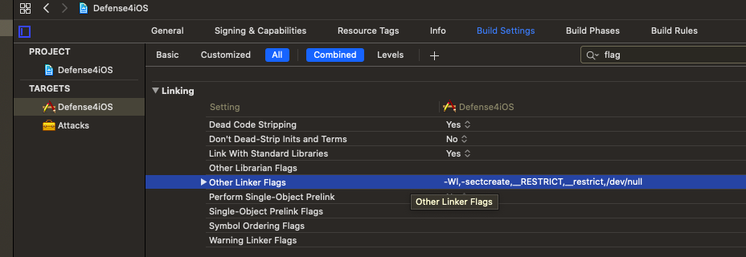
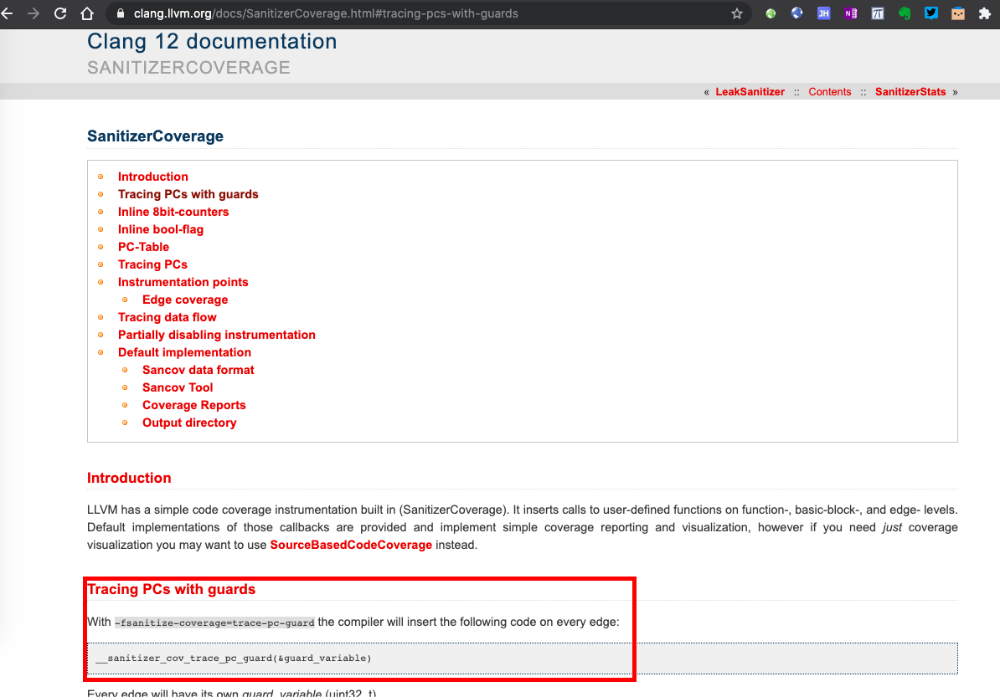
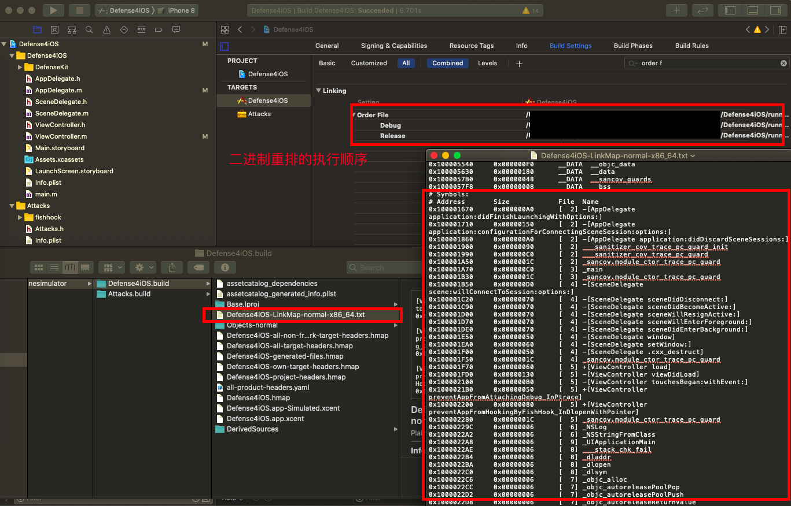
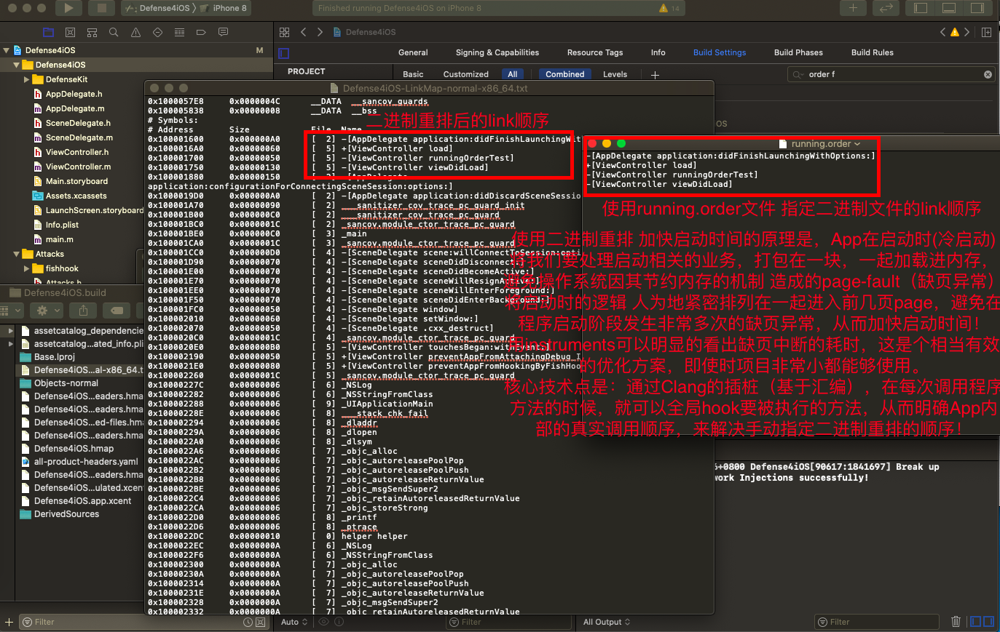

# Defense4iOS
Attack and Defense solutions for iOS. (This ReadMe.md file will be updated soon.)

* Attack App in dynamic-framework hacked in swizzling method(RunTime)
* Attack App in dynamic-framework hacked in fishhook (Demo)
* Checking dynamic-libs on WhiteList or not (Demo)
* Prevent Attaching-Debug in Mach-O with RESTRICT_SEGMENT_INFO

* Prevent Attaching-Debug in ptrace
* Prevent Attaching-Debug in dlopen
* Prevent fishhook from hooking system-core methods
* Clang sanitizer for binary-reSort and global-methods-hook(AssemblyLevel) 

